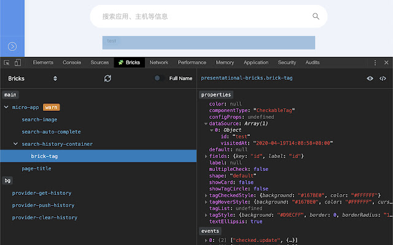
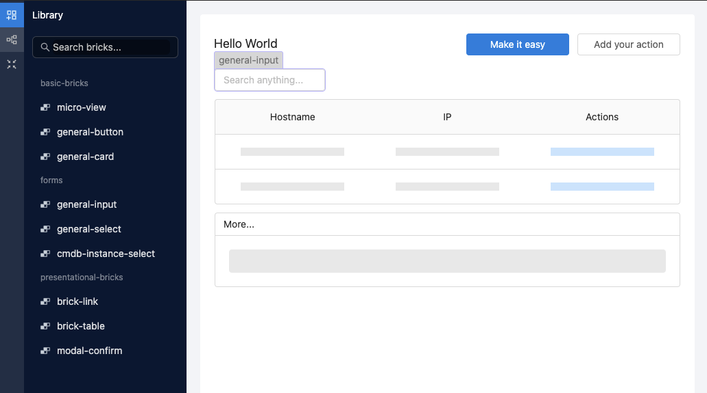

# A Demo Repo of Easy Bricks

[English](#readme) | [简体中文](#简体中文)

## Introduction

This is a server-free example to demonstrate how to build micro-apps with [_Easy Bricks_](https://github.com/easyops-cn/next-core) (formerly named _Brick Next_). Please refer to [**easyops-cn/next-core**](https://github.com/easyops-cn/next-core) for the source code of the core framework.

In this demo, your can build your own micro-apps by configuring YAMLs. The more powerful visualization _Easy MA Builder_ is just on the way to public soon.

> _Easy Bricks_ (formerly named _Brick Next_) is a front-end framework to build highly-pluggable and highly-configurable enterprise user interface solutions, a.k.a a low-code framework, which scales and for enterprise.
>
> The front-end of UWinTech's brand new DevOps platform _EasyOps_ is fully built on Easy Bricks. Hundreds of micro-apps are rapidly and continuously delivered to our enterprise clients. Building enterprise productivity tools has never been easier.

- [Getting Started](#getting-started)
  - [Pre-requests](#pre-requests)
  - [Installing Dependencies](#installing-dependencies)
  - [Starting to Serve](#starting-to-serve)
  - [Building Micro-Apps](#building-micro-apps)
  - [Development with Bricks](#development-with-bricks)
- [What's Next](#whats-next)
- [License](#license)

## Getting Started

You can just clone or fork this repository, or click the `Use this template` button on GitHub to create your own repository, to play with this demo.

> To figure out how this system works, we suggest you read [Easy Bricks Under the Hood](https://github.com/easyops-cn/next-core#easy-bricks-under-the-hood) first.

### Pre-requests

Make sure you have installed [Node.js](https://nodejs.org/) v12+ and [Yarn](https://classic.yarnpkg.com/) 1.x (Classic).

### Installing Dependencies

Open your terminal, go to the repository directory, run `yarn`.

### Starting to Serve

Run `yarn serve`, and open `http://localhost:8081/` in your browser. That's it!

> Tips: Enter any username and the same as password to get logged in, such as `duck` / `duck`.

### Building Micro-Apps

We have preset some micro-apps for you out of the box:

- Home: `./micro-apps/home/storyboard.yaml`
- Todo: `./micro-apps/todo/storyboard.yaml`

Feel free to modify any content in these YAMLs while `yarn serve` is running, the webpage will auto refresh when these YAMLs are changed.

E.g., change the `pageTile` to `Hola Mundo`.

> Tips: If you're using VS Code, we have built [a VS Code extension](https://marketplace.visualstudio.com/items?itemName=weareoutman.vscode-brick-next) which enables specific syntax highlighting for storyboards.

> Tips: Micro-app Car Store at `./micro-apps/car-store/storyboard.yaml` requires a custom brick, see [development with bricks](#development-with-bricks).

### Development with Bricks

👉 Wanna try something advanced and have fun? We also preset a brick to play with for you.

We used a custom brick in micro-app _Car Store_. To play with this custom brick, first, make sure `yarn serve` is running. Then, on local homepage, click button `Check Car Store`, or just open `http://localhost:8081/car-store`.

There would probably be no cars on the page right now. And there maybe an error log at the console of the browser devtools, and it says "Undefined custom element: car-store.car-for-sale".

That's because we have not built the brick yet. Let's run `yarn start --scope @next-bricks/car-store` in another terminal. This will start the process of building bricks while keep watching sourcefile changes.

It may take a few seconds, and there will be a running car appeared on the page 🚗 !

That's the car for sale in this car store. Try to change the paint, or stop/start the car.

The source code of `car-store.car-for-sale` is at `./bricks/car-store/src/car-for-sale`. The most logical code happens in `CarForSale.tsx` (a [React](https://reactjs.org/) [TypeScript](https://www.typescriptlang.org/) sourcefile). While there is a [Web Component](https://developer.mozilla.org/en-US/docs/Web/Web_Components) wrapper at `index.tsx`, which defines properties of this brick.

Try to add more functionalities to the car store, such as controlling the speed, or even make a U-turn. Just have fun!

> Tips: we have also built [a Chrome devtools extension](https://chrome.google.com/webstore/detail/brick-next-developer-tool/imfbjbfcldgkdbfgeoppalofbjfihpdp), which helps developers to debug with bricks. Its source code is at [easyops-cn/brick-next-devtools](https://github.com/easyops-cn/brick-next-devtools).

## What's Next

_Easy MA Builder_ - a visualization builder for micro-apps, is just on the way to public soon, please stay tuned.

## License

This demo is [MIT licensed](./LICENSE).

By the way, [Easy Bricks Core](https://github.com/easyops-cn/next-core) is [GPL-3.0 licensed](https://github.com/easyops-cn/next-core/blob/master/LICENSE).

## 简体中文

## 简介

本仓库是一个无需服务器的示例项目，用于演示如何基于 _Easy Bricks_ 搭建微应用。请参考框架核心的源代码：[**easyops-cn/next-core**](https://github.com/easyops-cn/next-core)。

在该演示项目中，您可以通过配置 YAML 文件的方式打造您的微应用。而更为强大的支持可视化编排微应用的 _Easy MA Builder_ 在不久后就会公开。

> _Easy Bricks_ （以前称为 _Brick Next_ ）是优维科技的新一代前端框架，旨在提供一套高度插件化、高度可配置化的企业用户界面解决方案，也即一个可扩展的、企业级的低代码开发框架。
>
> 优维科技全新的 DevOps 平台 _EasyOps_ 的前端整个基于 Easy Bricks 搭建。数百个企业级的微应用得以快速地、持续地交付给我们的企业客户。搭建企业级生产力工具从未如此简单。

- [开始](#开始)
  - [环境要求](#环境要求)
  - [安装依赖](#安装依赖)
  - [启动服务](#启动服务)
  - [搭建微应用](#搭建微应用)
  - [开发构件](#开发构件)
- [接下来](#接下来)
- [许可协议](#许可协议)

## 开始

您可以选择克隆或 fork 本仓库，或者点击 GitHub 上的 `Use this template` 来创建您自己的仓库，以体验这个 demo。

> 为了明白整个系统是如何工作的，我们建议您先阅读 [Easy Bricks 揭秘](https://github.com/easyops-cn/next-core#easy-bricks-揭秘)。

### 环境要求

请先确认您已经安装了 [Node.js](https://nodejs.org/) v12+ 以及 [Yarn](https://classic.yarnpkg.com/) 1.x (Classic)。

### 安装依赖

打开您的终端，进入项目目录，运行 `yarn`。

### 启动服务

运行 `yarn serve`，然后通过浏览器打开 `http://localhost:8081/`。就是这么简单！

> 提示：输入任意的用户名以及和用户名一样的密码来登录，例如 `duck` / `duck`。

### 搭建微应用

我们已经为您在项目中预置了几个微应用：

- Home: `./micro-apps/home/storyboard.yaml`
- Todo: `./micro-apps/todo/storyboard.yaml`

请尝试任意修改这些 YAML 文件，并保持 `yarn serve` 处于运行状态，页面将会在文件改动后自动更新。

例如，将 `pageTitle` 修改为 `Hola Mundo`。

> 提示：如果您使用的是 VS Code，我们还提供了[一个 VS Code 扩展](https://marketplace.visualstudio.com/items?itemName=weareoutman.vscode-brick-next)，支持 storyboards 的特定语法高亮。

> 提示：微应用 Car Store `./micro-apps/car-store/storyboard.yaml` 需要依赖一个自定义构件，请查看[开发构件](#开发构件)。

### 开发构件

👉 想要试一试更好玩、更进阶的功能？我们还预置了一个自定义构件让您体验。

我们在微应用 _Car Store_ 中使用了一个*自定义构件*。要体验这个自定义构件，首先，确认 `yarn serve` 还在运行。然后，在本地主页中，点击按钮 `Check Car Store`，或者直接打开 `http://localhost:8081/car-store`。

现在页面上很可能并没有任何汽车出现。并且如果打开浏览器开发者工具的控制台，会发现一条报错信息“Undefined custom element: car-store.car-for-sale”。

这是因为我们还没有构建它。打开另一个终端，运行 `yarn start --scope @next-bricks/car-store`。这条命令将启动打包构件的程序，并且实时响应源文件的变更。

几秒钟后，构建完成，页面上出现了一辆行驶中的汽车 🚗 ！

这就是本销售处在卖的汽车了。试试改变它的喷漆，停止或启动它。

构件 `car-store.car-for-sale` 的源代码位于 `./bricks/car-store/src/car-for-sale`。大部分的逻辑代码在
`CarForSale.tsx` 中。同时还有一个 [Web Component](https://developer.mozilla.org/en-US/docs/Web/Web_Components) 的包装，用于定义构件的属性。

请试着为汽车商店添加更多的功能，例如控制汽车的速度，甚至控制它掉个头。玩得开心！

> 提示：我们还提供了[一个 Chrome 开发者工具扩展](https://chrome.google.com/webstore/detail/brick-next-developer-tool/imfbjbfcldgkdbfgeoppalofbjfihpdp)，用以帮助开发者调试构件。源代码托管在 [easyops-cn/brick-next-devtools](https://github.com/easyops-cn/brick-next-devtools)。

## 接下来

_Easy MA Builder_ -- 可视化的微应用编排工具不久后就将公开，敬请期待。

## 许可协议

本演示项目使用 [MIT 协议](./LICENSE)。

另外注意 [Easy Bricks Core](https://github.com/easyops-cn/next-core) 使用 [GPL-3.0 协议](https://github.com/easyops-cn/next-core/blob/master/LICENSE)。
